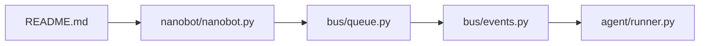
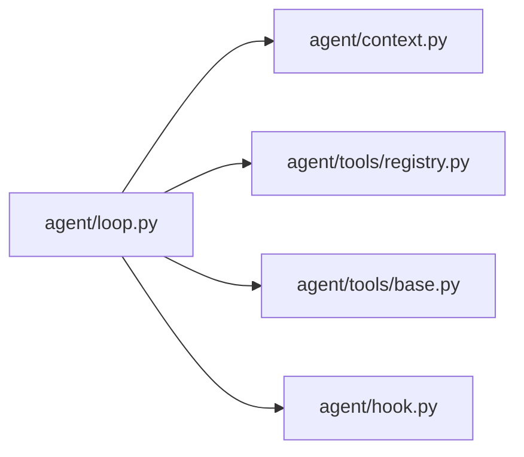
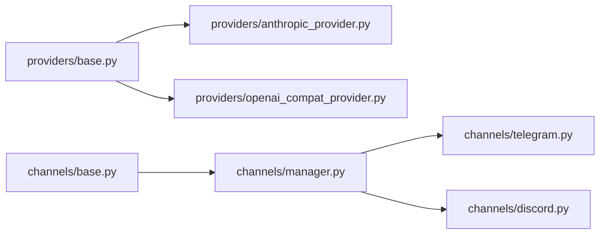
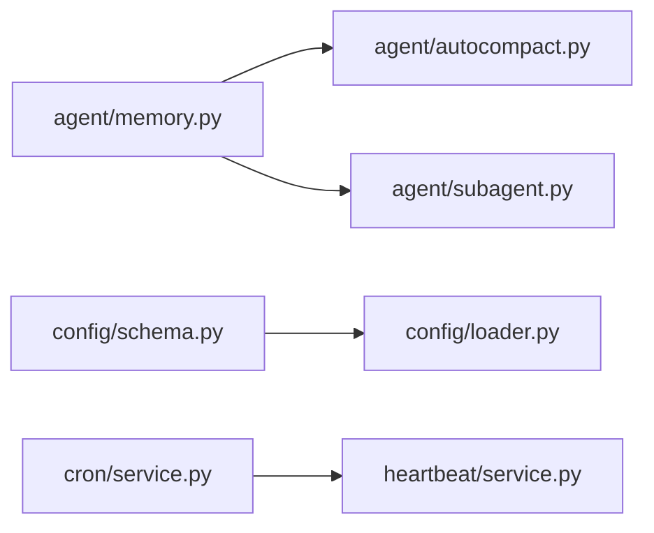

# NanoBot 项目深度分析

> **NanoBot** 是香港大学数据科学实验室 (HKUDS) 开源的超轻量级 AI Agent 框架，灵感来自 OpenClaw、Claude Code 和 Codex。核心理念是保持 agent loop 小而可读，同时支持聊天频道、记忆、MCP 和生产级部署。

---

## 1. 项目核心特征

### 1.1 架构特征

| 特征 | 说明 |
|------|------|
| **超轻量核心** | 核心 agent loop 只有 ~500 行（`runner.py`），整个包约 80+ 个 Python 文件 |
| **消息总线解耦** | 通过 `MessageBus`（`asyncio.Queue`）将频道、Agent、工具三层解耦 |
| **插件式 Provider** | 12+ 个 LLM 提供商，新增一个只需 2 步（实现 `LLMProvider` + 注册） |
| **插件式 Channel** | 15+ 个聊天频道（Telegram、Discord、飞书、微信、Slack 等），统一 `BaseChannel` 接口 |
| **异步全链路** | 从消息接收到工具执行全链路 `asyncio`，支持并发工具调用和子 Agent |
| **Context-aware Memory** | 两阶段记忆：`Consolidator`（token 压缩）+ `Dream`（周期性记忆整理） |

### 1.2 功能特征

- **多模型支持**: Anthropic、OpenAI、Azure、Bedrock、GitHub Copilot、DeepSeek、MiniMax、Moonshot、StepFun、小米 MiMo 等 12+ 提供商
- **多渠道接入**: Telegram、Discord、飞书、微信、企业微信、Slack、QQ、WhatsApp、Matrix、钉钉、Email、MS Teams
- **MCP 集成**: 支持 Model Context Protocol，可连接外部 MCP Server 作为工具源
- **Agent Social Network**: Agent 之间可以通过渠道互通
- **子 Agent 系统**: `SubagentManager` 管理后台任务执行，支持跨 Session 的子 Agent 通信
- **定时任务**: `CronService` 支持自然语言调度，定期提醒和自动执行
- **WebUI**: 基于 React + Vite + Tailwind 的实时聊天界面
- **OpenAI 兼容 API**: 支持 SSE 流式输出，可作为本地 API Server 使用
- **Python SDK**: `Nanobot` facade 类提供简洁的编程接口

---

## 2. 技术难点分析

### 2.1 Agent Loop 的鲁棒性（最核心难点）

`AgentRunner.run()`（`runner.py:232`）需要处理大量边界情况：

```
迭代循环中的上下文治理流程:
messages → _drop_orphan_tool_results → _backfill_missing_tool_results
         → _microcompact → _apply_tool_result_budget → _snip_history
         → 再次清理 → 发送给 LLM
```

**难点拆解**:
- **孤儿工具结果处理**: 历史压缩后可能产生无匹配 `tool_call_id` 的工具结果，需要 `_drop_orphan_tool_results` 清理
- **缺失工具结果回填**: assistant 消息声明了 tool_call 但没有对应结果时，需要 `_backfill_missing_tool_results` 插入合成错误结果
- **Micro-compact**: 对旧的可压缩工具结果（`read_file`、`exec` 等）用一行摘要替代完整内容，控制上下文窗口
- **History Snipping**: 当 token 超过上下文窗口时，从旧到新裁剪历史，但保证从 user 消息开始、满足 provider 角色交替要求
- **空响应重试**: 最多 2 次重试空响应，超过则尝试 finalization retry
- **长度截断恢复**: 输出被 `length` finish_reason 截断时，最多 3 次继续生成

### 2.2 并发控制与 Session 隔离

```python
# loop.py 中的并发架构
_session_locks: dict[str, asyncio.Lock]       # per-session 串行锁
_concurrency_gate: asyncio.Semaphore          # 全局并发门控 (默认3)
_pending_queues: dict[str, asyncio.Queue]      # mid-turn 消息注入队列
_active_tasks: dict[str, list[asyncio.Task]]   # 活跃任务追踪
```

**难点**:
- 同一 Session 内的消息必须串行处理（锁），不同 Session 可以并发（信号量）
- 用户在 Agent 处理中发送新消息时，不创建新任务，而是注入到 `pending_queue` 进行 **mid-turn injection**
- `/stop` 命令需要取消正在运行的任务，并恢复部分上下文（checkpoint 机制）
- 子 Agent 完成后的结果需要通过 `pending_queue` 注入父 Agent 的当前 turn

### 2.3 Provider 抽象层

```python
# providers/base.py 核心抽象
class LLMProvider(ABC):
    async def chat(...) -> LLMResponse          # 非流式调用
    async def chat_stream(...) -> LLMResponse   # 流式调用（默认降级到非流式）
    async def chat_with_retry(...)              # 带重试的调用
    async def chat_stream_with_retry(...)       # 带重试的流式调用
```

**难点**:
- **跨提供商兼容**: OpenAI 和 Anthropic 的 tool_call 格式不同，`LLMResponse` 统一抽象
- **重试策略**: 区分瞬态错误（429/500/502/503）和永久错误（quota exceeded），支持 `standard` 和 `persistent` 两种模式
- **角色交替**: `_enforce_role_alternation()` 处理不同 provider 对消息格式的要求差异（OpenAI 不支持 trailing assistant，GLM 不支持 system→assistant）
- **图像降级**: 当 provider 不支持图像时，自动用文本占位符替换 `image_url` 块

### 2.4 Memory 系统

```
MemoryStore (纯文件 I/O)
├── MEMORY.md      — 长期记忆
├── history.jsonl  — 对话历史
├── SOUL.md        — Agent 人格定义
└── USER.md        — 用户信息

Consolidator — Token 基础的上下文压缩
Dream        — 周期性记忆整理（两阶段：分析 + 执行）
```

**难点**:
- **Consolidator** 需要在不丢失关键上下文的前提下压缩 session 历史
- **Dream** 使用两阶段处理：Phase 1 分析历史条目并标注 git-blame 时间戳，Phase 2 执行记忆更新
- **GitStore** 跟踪记忆文件的版本变化，支持 `annotate_line_ages` 功能

### 2.5 频道适配

每个频道有独特的需求：

| 频道 | 特殊处理 |
|------|---------|
| Telegram | 长消息分割、inline buttons、草稿流式 |
| Discord | Thread session、embed 限制、反应表情 |
| 飞书 | CardKit 流式、富文本解析、@提及 |
| 微信 | QR 登录、语音转文字、多模态对齐 |
| Matrix | E2E 加密、markdown 渲染 |
| Slack | Thread isolation、mrkdwn 格式 |

---

## 3. 学习路径推荐

### 3.1 入门阶段：理解核心概念（1-2 天）

**阅读顺序**：



1. **`README.md`** — 了解项目定位、功能和使用方式
2. **`nanobot/nanobot.py`** — Python SDK facade，理解最简调用方式（~120 行）
3. **`bus/queue.py` + `bus/events.py`** — 理解消息总线机制（`InboundMessage` / `OutboundMessage`）
4. **`agent/runner.py`** — 核心 Agent 执行循环，这是整个项目的心脏

### 3.2 进阶阶段：深入 Agent Loop（2-3 天）



5. **`agent/loop.py`** — Agent 主循环：消息分发、Session 管理、并发控制、mid-turn injection
6. **`agent/context.py`** — 上下文构建：系统提示、记忆、技能的组装逻辑
7. **`agent/tools/registry.py` + `agent/tools/base.py`** — 工具注册和执行机制
8. **`agent/hook.py`** — 生命周期钩子系统（before_iteration、after_iteration 等）

### 3.3 深入阶段：Provider 与 Channel（2-3 天）



9. **`providers/base.py`** — LLM Provider 抽象、重试策略、角色交替
10. **`providers/factory.py` + `providers/registry.py`** — Provider 工厂和注册表
11. **`channels/base.py`** — 频道抽象接口
12. **`channels/manager.py`** — 频道管理和消息路由
13. 选读 1-2 个具体频道实现（推荐 `telegram.py` 或 `feishu.py`）

### 3.4 高级阶段：Memory 与子系统（2-3 天）



14. **`agent/memory.py`** — MemoryStore + Consolidator + Dream 三合一
15. **`agent/autocompact.py`** — 自动上下文压缩
16. **`agent/subagent.py`** — 子 Agent 管理
17. **`config/schema.py`** — Pydantic 配置模型
18. **`cron/service.py`** — 定时任务服务
19. **`command/router.py` + `command/builtin.py`** — 命令路由系统

### 3.5 实践建议

```
推荐实践顺序:
1. 克隆项目，运行 `nanobot onboard` 完成初始化
2. 使用 CLI 模式 (`nanobot agent`) 体验基本对话
3. 阅读 tests/ 目录中的测试用例理解各模块的行为
4. 尝试注册一个自定义 Tool（参考 agent/tools/base.py）
5. 尝试实现一个自定义 Channel（参考 channel-plugin-guide.md）
6. 阅读 MCP 集成代码，理解外部工具扩展机制
```

---

## 4. 代码结构总览

```
nanobot/
├── nanobot/                      # 主 Python 包
│   ├── __init__.py               # 包入口，导出版本
│   ├── __main__.py               # python -m nanobot 入口
│   ├── nanobot.py                # ★ Python SDK facade (Nanobot 类)
│   │
│   ├── agent/                    # ★ 核心 Agent 子系统
│   │   ├── loop.py               #   AgentLoop: 消息分发、Session、并发控制
│   │   ├── runner.py             #   ★ AgentRunner: 核心执行循环 (tool-using loop)
│   │   ├── context.py            #   ContextBuilder: 系统提示 + 历史 + 记忆组装
│   │   ├── memory.py             #   MemoryStore + Consolidator + Dream
│   │   ├── autocompact.py        #   AutoCompact: 自动上下文压缩
│   │   ├── hook.py               #   AgentHook: 生命周期钩子系统
│   │   ├── skills.py             #   SkillsLoader: 技能文件加载
│   │   ├── subagent.py           #   SubagentManager: 后台子Agent管理
│   │   └── tools/                #   工具子系统
│   │       ├── base.py           #     Tool 抽象基类
│   │       ├── registry.py       #     ToolRegistry: 动态工具注册/执行
│   │       ├── schema.py         #     工具 JSON Schema 定义
│   │       ├── ask.py            #     ask_user: 用户交互工具
│   │       ├── filesystem.py     #     read_file / write_file / edit_file / list_dir
│   │       ├── search.py         #     glob / grep: 文件搜索
│   │       ├── shell.py          #     exec: 命令执行 (沙箱支持)
│   │       ├── web.py            #     web_search / web_fetch
│   │       ├── message.py        #     message: 跨频道消息发送
│   │       ├── spawn.py          #     spawn: 子Agent创建
│   │       ├── cron.py           #     cron: 定时任务工具
│   │       ├── notebook.py       #     notebook_edit: Jupyter 编辑
│   │       ├── mcp.py            #     MCP 服务器连接和工具桥接
│   │       ├── self.py           #     my: 运行时自检工具
│   │       ├── sandbox.py        #     Shell 沙箱隔离
│   │       └── file_state.py     #     文件读写状态追踪
│   │
│   ├── providers/                # ★ LLM 提供商子系统
│   │   ├── base.py               #   LLMProvider ABC + 重试策略 + 角色交替
│   │   ├── factory.py            #   make_provider: Provider 工厂
│   │   ├── registry.py           #   Provider 注册表 + 自动检测
│   │   ├── anthropic_provider.py #   Anthropic (Claude) 直连
│   │   ├── openai_compat_provider.py  # OpenAI 兼容 (通用)
│   │   ├── azure_openai_provider.py   # Azure OpenAI
│   │   ├── bedrock_provider.py        # AWS Bedrock
│   │   ├── github_copilot_provider.py # GitHub Copilot
│   │   ├── openai_codex_provider.py   # OpenAI Codex (OAuth)
│   │   └── openai_responses/     #   OpenAI Responses API 解析
│   │
│   ├── channels/                 # ★ 聊天频道子系统
│   │   ├── base.py               #   BaseChannel ABC
│   │   ├── manager.py            #   ChannelManager: 频道生命周期管理
│   │   ├── registry.py           #   频道注册表
│   │   ├── telegram.py           #   Telegram Bot
│   │   ├── discord.py            #   Discord Bot
│   │   ├── feishu.py             #   飞书
│   │   ├── slack.py              #   Slack
│   │   ├── weixin.py             #   微信 (个人号)
│   │   ├── wecom.py              #   企业微信
│   │   ├── qq.py                 #   QQ
│   │   ├── whatsapp.py           #   WhatsApp
│   │   ├── matrix.py             #   Matrix
│   │   ├── dingtalk.py           #   钉钉
│   │   ├── email.py              #   Email
│   │   ├── msteams.py            #   MS Teams
│   │   ├── mochat.py             #   MoChat
│   │   └── websocket.py          #   WebSocket (WebUI 通道)
│   │
│   ├── bus/                      # 消息总线
│   │   ├── events.py             #   InboundMessage / OutboundMessage 数据类
│   │   └── queue.py              #   MessageBus: asyncio.Queue 双队列
│   │
│   ├── cli/                      # 命令行界面
│   │   ├── commands.py           #   Typer CLI 命令定义 (agent/gateway/serve/onboard)
│   │   ├── onboard.py            #   交互式初始化向导
│   │   ├── stream.py             #   CLI 流式输出
│   │   └── models.py             #   CLI 模型选择
│   │
│   ├── command/                  # 聊天内命令 (/stop, /restart 等)
│   │   ├── router.py             #   CommandRouter: 优先级/精确/前缀路由
│   │   └── builtin.py            #   内置命令注册
│   │
│   ├── config/                   # 配置管理
│   │   ├── schema.py             #   Pydantic 配置模型 (Config, AgentDefaults 等)
│   │   ├── loader.py             #   config.json 加载和解析
│   │   └── paths.py              #   路径解析 (~/.nanobot/)
│   │
│   ├── session/                  # 会话管理
│   │   └── manager.py            #   SessionManager + Session (JSONL 持久化)
│   │
│   ├── cron/                     # 定时任务
│   │   ├── service.py            #   CronService: 调度和执行
│   │   └── types.py              #   CronSchedule 数据类
│   │
│   ├── heartbeat/                # 心跳服务
│   │   └── service.py            #   虚拟 tool-call 心跳
│   │
│   ├── security/                 # 安全
│   │   └── network.py            #   网络安全策略
│   │
│   ├── api/                      # OpenAI 兼容 API
│   │   └── server.py             #   aiohttp HTTP Server
│   │
│   ├── utils/                    # 工具函数
│   │   ├── helpers.py            #   通用辅助 (消息构建、token 估算、文本处理)
│   │   ├── prompt_templates.py   #   Jinja2 模板渲染
│   │   ├── document.py           #   文档提取 (PDF/DOCX/XLSX/PPTX)
│   │   ├── gitstore.py           #   Git 版本追踪 (dulwich)
│   │   ├── runtime.py            #   运行时辅助
│   │   ├── progress_events.py    #   进度事件构建
│   │   ├── tool_hints.py         #   工具调用提示格式化
│   │   ├── evaluator.py          #   表达式求值
│   │   ├── media_decode.py       #   媒体解码
│   │   ├── path.py               #   路径工具
│   │   ├── restart.py            #   重启通知
│   │   ├── searchusage.py        #   搜索使用统计
│   │   └── truncate_text.py      #   文本截断
│   │
│   ├── templates/                # Jinja2 提示模板
│   │   └── memory/               #   记忆相关模板
│   │
│   ├── skills/                   # 内置技能
│   │   └── skill-creator/        #   技能创建工具
│   │
│   └── web/                      # WebUI Python 包入口
│
├── webui/                        # ★ 前端 WebUI (React + Vite + Tailwind)
│   ├── src/
│   │   ├── main.tsx              #   React 入口
│   │   ├── App.tsx               #   主应用组件
│   │   └── globals.css           #   全局样式
│   ├── package.json              #   bun 依赖
│   └── vite.config.ts            #   Vite 配置
│
├── bridge/                       # TypeScript 桥接层
│
├── tests/                        # ★ 测试套件 (~100+ 测试文件)
│   ├── agent/                    #   Agent 子系统测试
│   ├── channels/                 #   频道测试 (每个频道都有)
│   ├── providers/                #   Provider 测试 (每个提供商都有)
│   ├── tools/                    #   工具测试
│   ├── config/                   #   配置测试
│   ├── session/                  #   会话测试
│   ├── cron/                     #   定时任务测试
│   ├── heartbeat/                #   心跳测试
│   ├── security/                 #   安全测试
│   ├── cli/                      #   CLI 测试
│   ├── command/                  #   命令测试
│   └── utils/                    #   工具函数测试
│
├── docs/                         # 项目文档
├── case/                         # 演示 GIF
├── images/                       # 图片资源
├── pyproject.toml                # Python 项目配置 (hatchling)
├── Dockerfile                    # Docker 镜像
├── docker-compose.yml            # Docker Compose (gateway + api + cli)
└── entrypoint.sh                 # Docker 入口脚本
```

---

## 5. 关键设计模式

### 5.1 消息流架构

```
┌─────────────┐    InboundMessage    ┌────────────┐    prompt    ┌───────────┐
│  Channels   │ ──────────────────→  │  AgentLoop  │ ─────────→  │  LLM      │
│ (Telegram,  │                      │  (loop.py)  │             │  Provider │
│  Discord..) │                      │             │ ←─────────  │           │
└─────────────┘                      └──────┬──────┘  response   └───────────┘
                                            │
                                            │ tool_calls
                                            ▼
                                     ┌──────────────┐
                                     │ ToolRegistry  │
                                     │ (registry.py) │
                                     └──────────────┘
```

- **Inbound**: Channel → `MessageBus.inbound` → `AgentLoop.run()` → `AgentRunner.run()`
- **Outbound**: `AgentRunner.run()` → `MessageBus.outbound` → `ChannelManager.send()` → Channel

### 5.2 Hook 生命周期

```
before_iteration → LLM 请求 → [streaming deltas] → before_execute_tools
    → 工具执行 → after_iteration → [repeat or break]
```

`CompositeHook` 支持多 hook 扇出，用于 Langfuse 观测、子 Agent 状态更新等。

### 5.3 上下文治理管道

```
原始 messages
  → _drop_orphan_tool_results()     # 删除孤立工具结果
  → _backfill_missing_tool_results() # 回填缺失工具结果
  → _microcompact()                  # 压缩旧工具结果
  → _apply_tool_result_budget()      # 截断超长工具结果
  → _snip_history()                  # 裁剪超出上下文窗口的历史
  → 再次清理 (orphan + backfill)     # 裁剪可能引入新的孤儿
```

### 5.4 Provider 抽象模式

```python
# 新增 Provider 只需:
class MyProvider(LLMProvider):
    async def chat(self, messages, tools, ...) -> LLMResponse:
        # 调用具体 API
        ...
        return LLMResponse(content=..., tool_calls=[...])
    
    def get_default_model(self) -> str:
        return "my-model-name"
```

然后在 `registry.py` 注册即可。

---

## 6. 项目难点总结

| 难点 | 复杂度 | 核心文件 |
|------|--------|---------|
| Agent Loop 鲁棒性 (上下文治理) | ⭐⭐⭐⭐⭐ | `runner.py` |
| 并发控制 + Session 隔离 + Mid-turn Injection | ⭐⭐⭐⭐⭐ | `loop.py` |
| 多 Provider 兼容 (角色交替、图像降级、重试) | ⭐⭐⭐⭐ | `providers/base.py` |
| 15+ 频道适配 (格式、流式、媒体) | ⭐⭐⭐⭐ | `channels/*.py` |
| Memory 系统 (Consolidator + Dream) | ⭐⭐⭐⭐ | `memory.py` |
| 工具沙箱安全 | ⭐⭐⭐ | `tools/sandbox.py`, `tools/shell.py` |
| MCP 协议集成 | ⭐⭐⭐ | `tools/mcp.py` |
| 子 Agent 管理与通信 | ⭐⭐⭐ | `subagent.py` |
| Context Window 裁剪算法 | ⭐⭐⭐⭐ | `runner.py: _snip_history()` |

---

## 7. 与其他项目的对比

| 维度 | NanoBot | Claude Code | LangChain |
|------|---------|-------------|----------|
| 定位 | 轻量个人 Agent | 代码助手 | Agent 框架 |
| 代码量 | ~80 Python 文件 | 闭源 | 数百文件 |
| 频道支持 | 15+ (内置) | CLI only | 需插件 |
| Provider | 12+ (原生) | Anthropic only | 多 (litellm) |
| 记忆系统 | 文件 I/O + Dream | 内存 | 多种集成 |
| 学习曲线 | 中等 | 低 | 高 |
| 研究友好度 | 高 (代码简洁) | 低 (闭源) | 中 (抽象层多) |

---

## 8. 进一步探索

- [Configuration 文档](https://nanobot.wiki/docs/latest/getting-started/nanobot-overview)
- [Channel Plugin Guide](https://github.com/HKUDS/nanobot/blob/main/docs/channel-plugin-guide.md)
- [Memory 系统文档](https://github.com/HKUDS/nanobot/blob/main/docs/memory.md)
- [Python SDK 文档](https://github.com/HKUDS/nanobot/blob/main/docs/python-sdk.md)
- [OpenAI API 兼容文档](https://github.com/HKUDS/nanobot/blob/main/docs/openai-api.md)
